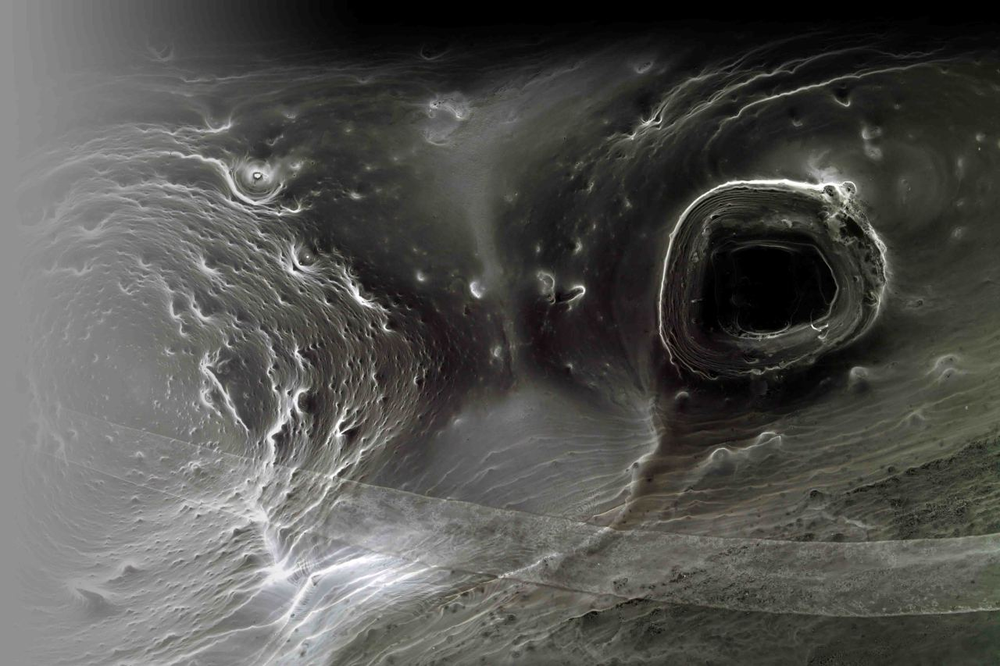
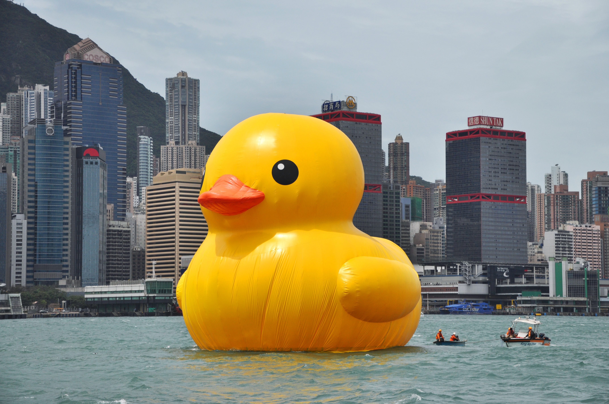
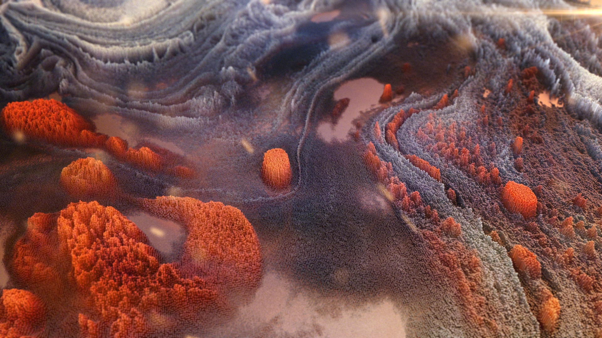
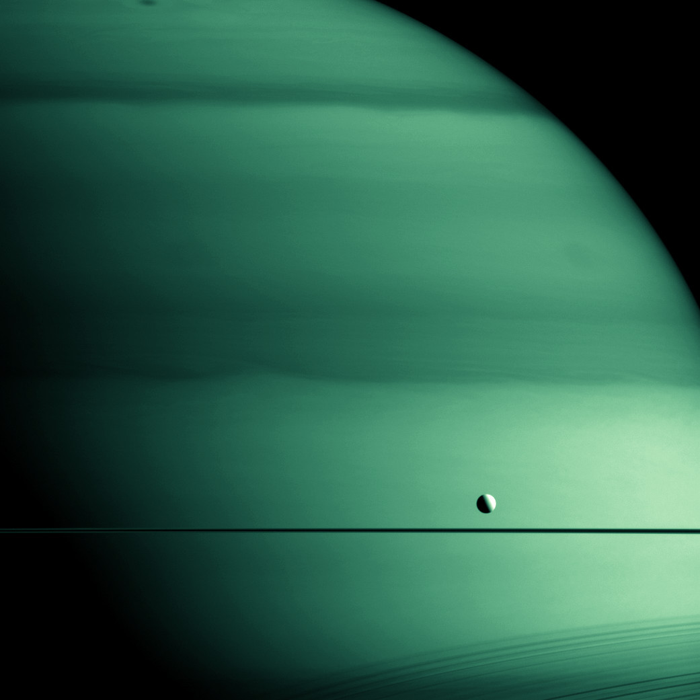
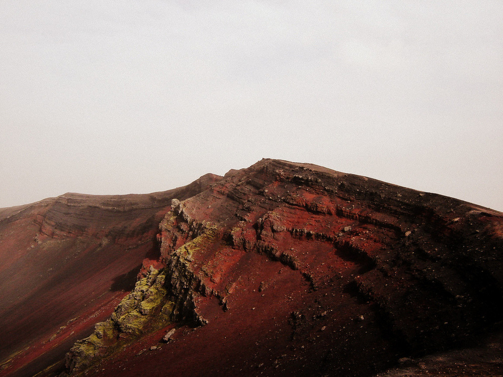
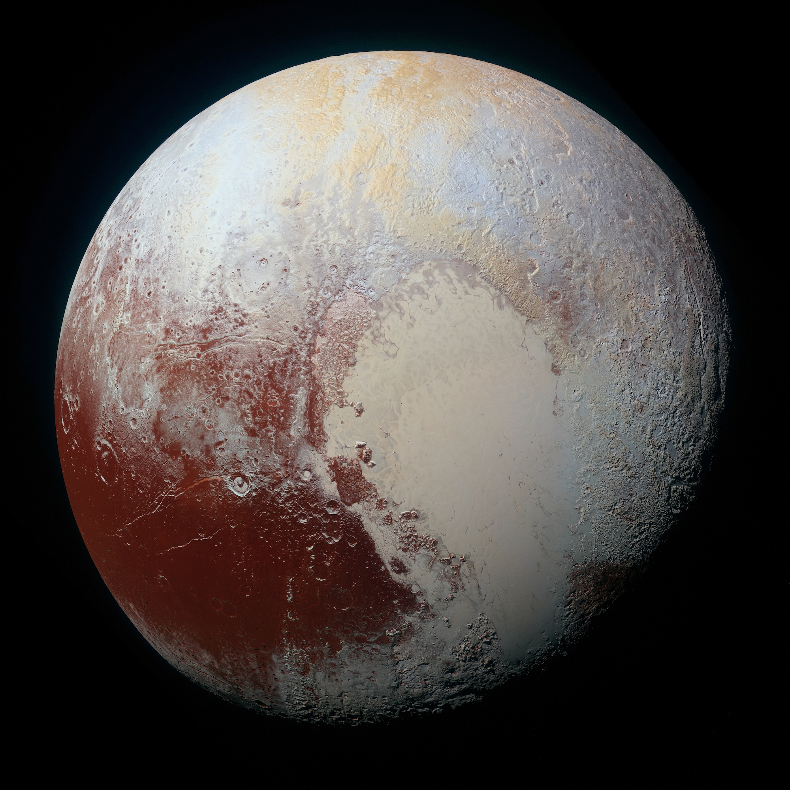
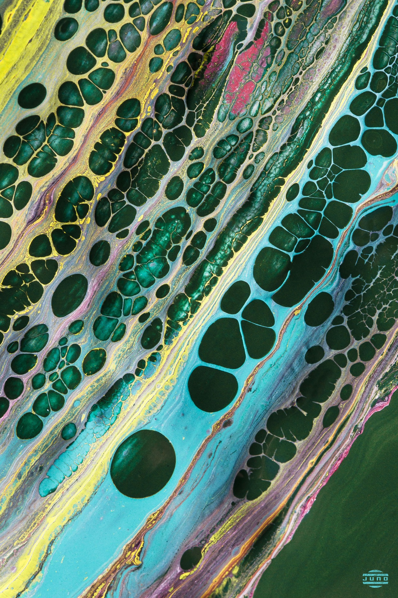

theme: Poster, 1

# [fit] _**The GRust session**_

---

### The ecosystem

_The ecosystem is all the tools that help use the language_

---

# [fit] _**Match**_

---

# [fit] _**Standard**_

---

# [fit] _**Mecanics**_

---

# [fit] _**Go Duck Typing**_

---

# [fit] _**Rust Traits**_

---

# [fit] _**Generics**_

---

## [fit] _**Linear Types**_

---

# [fit] _**Iterators**_

---

# [fit] _**Lifetimes**_

---

# [fit] _**Documentation**_

---

# [fit] _**Practice**_

