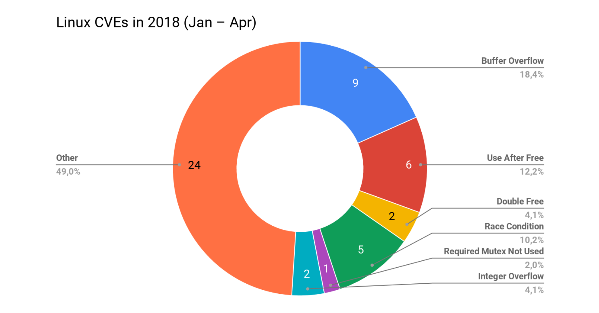
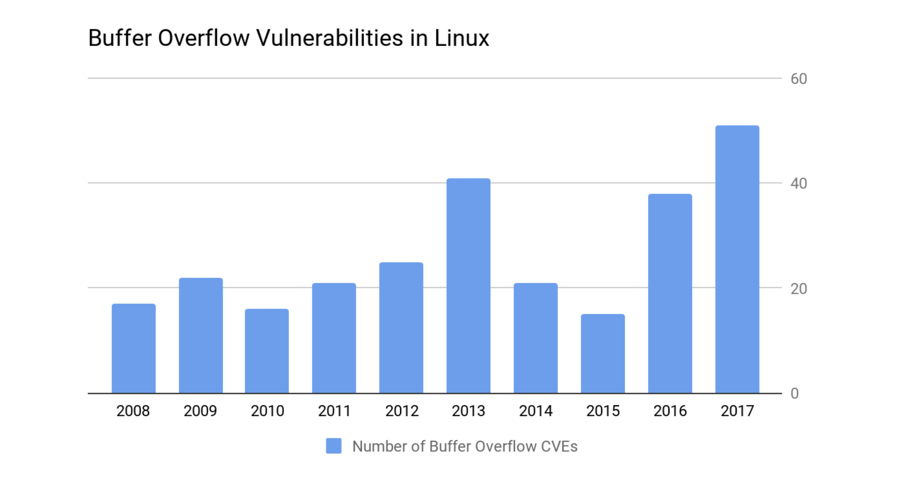
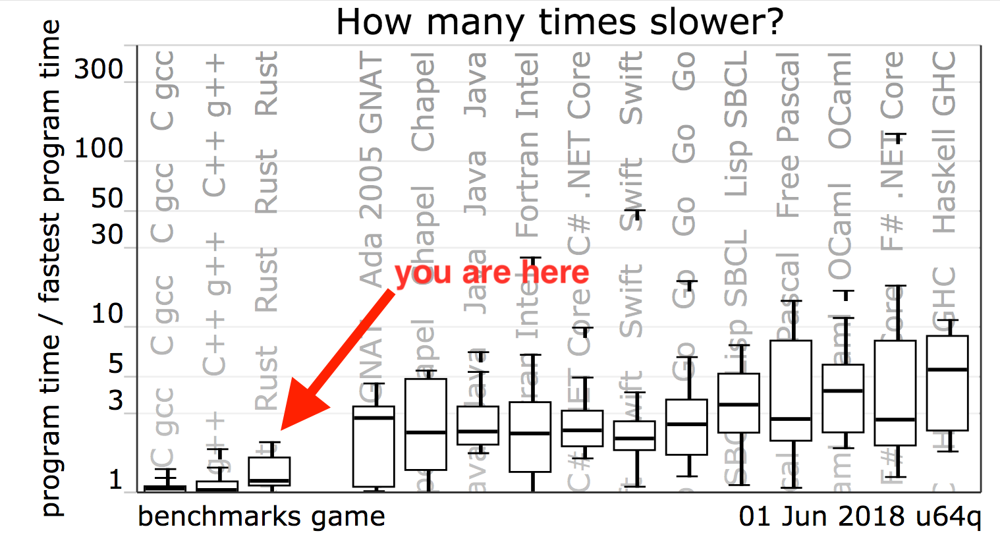

theme: Poster, 1

# [fit] _**Programming is Hard**_


---

### _**because we are all humans and humans depends on software and its quality**_


---

# The Therac-25 horror story

A radiaton therapy machine produced in 1982. Involved in at least _**6 accidents**_ between 1985 and 1987 in which patients were given _**massive overdose of radiation**_.

Because of concurrent programming errors, it sometimes gave its patients radiation doses that were hundreds of times greater than normal, resulting in _**death**_ or _**serious injury**_.


---

There is a huge difference between

"_program correctness was **checked** by tests_"

and

"_program correctness was logically **proven**_"


---



---

# _**buffer overflow bugs are one of the most dangerous**_


---

## they often cause secrets to be compromised, denial of service and remote code execution vulnerabilities


<!--

heartbleed.com

Linux kernel is written by best of the best, top 5% of the industry

-->

---



---

# [fit] _**At what cost?**_


---

No garbage collector. You pay for what you need.

When you need to share readable and writable data, Rust will _force_ you to use thread synchronized primitives (e.g. Mutex, Atomic types).

You can express everything that you could have expressed in _C_ or _C++_. Even _[SIMD]_ instructions are available in the standard library. You may unleash the full potential of your hardware by using [convenient wrapper libraries].

[convenient wrapper libraries]: https://github.com/jackmott/simdeez
[SIMD]: https://fr.wikipedia.org/wiki/Single_instruction_multiple_data


---



---

# [fit] _**Tests**_


---

Note that for performance reasons, the standard library contains a lot of potentially unsafe code and raw pointer arithmetic. This is the main reason why tests are important.

As of the 10 of july 2017 there are a little over _6k_ tests in the Rust test suite. All features and bug fixes are accompanied by test cases.


---

Wrappers are everywhere in Rust, concepts that needs performances are often implemented with unsafe code that permit raw communication with the hardware.

Multi-threading libraries use this concept to abstract thread synchronization and let the user focus on its own work.

```rust
let sum = many_numbers.iter().sum();

let sum = many_numbers.par_iter().sum();
```


---

# [fit] _**Libraries**_


---

Rust is design around libraries and external code. [crates.io] is the home of all those.

Libraries in Rust are versionned using [semver], something that looks like `1.0.4`. Not compiling code caused by dependency updates doing breaking changes are less to be present.

[Semverver] is a tool that is developed by Google to add more restrictions on library updates (e.g. disallow changing a public function without updating the major number).

[crates.io]: https://crates.io
[semver]: https://semver.org
[Semverver]: https://github.com/rust-lang-nursery/rust-semverver


---

# [fit] _**Ecosystem**_


---

# A project compiler that is a package manager

[crates.io] is the official registry that holds public libraries of the community, only depends on tarballs saved on AWS.

[docs.rs] is the official platform to get the documentation of a crate that is available on crates.io.

If do not have an internet access, you can have the documentation of any crate by doing `cargo doc` or by using `rustup doc` to have the standard library.

[crates.io]: https://crates.io
[docs.rs]: https://docs.rs


---

## [fit] _**Important Projects**_


---

[TiKV] a key-value store developed by Pingcap used in production by [Ele.me] which means "_Are you hungry?_" acquired by Alibaba for $9.5 billion USD.

[servo] is a prototype web browser engine sponsored by Mozilla used to help improve Firefox.

[ripgrep] a line-oriented search tool that can be compared to what grep already do but much more fastly.

[TiKV]: https://github.com/pingcap/tikv
[Ele.me]: https://en.wikipedia.org/wiki/Ele.me
[servo]: https://github.com/servo/servo
[ripgrep]: https://github.com/BurntSushi/ripgrep


---

# [fit] _**Who use it?**_


---

Dropbox developed [DivANS] for there compression system and reduced the size of file by roughly 22%.

NPM, by replacing C and rewriting performance-critical bottlenecks in the registry service architecture.

Atlassian in a service for analyzing petabytes of source code.

Baidu, to provides the ability to [write Intel SGX applications], in other words: remotely execute WASM in a secure way.

[DivANS]: https://blogs.dropbox.com/tech/2018/06/building-better-compression-together-with-divans/
[write Intel SGX applications]: https://github.com/baidu/rust-sgx-sdk


---

# [fit] [nphysics demo](http://demo.nphysics.org)


